# FlexiSaf Cohort 26 Task 2

## Learning Objectives
• Understanding and implementation of Git Commands from the CLI

• Undestanding GitHub as a cloud storage for repositories and a means for collaboration among developers

## Learning Outcomes
• Creating repository locally and remotely

• Cloning remote repository to local machine 

• Staging and committing changes

• Reverting and resetting commit actions

• Accessing git logs

• Creating Branch, renaming branch, merging branches and resolving branch conflicts 

• Pushing changes to remote repository. Fetching and pulling from remote repository to local machine 

• Stashing

• Rebasing and making pull request

## Practical Implementations

### GitHub Repository link
[Github Repo](https://github.com/yunus-shuaib/git-basics.git)

### CLI
#### git clone and git add commands
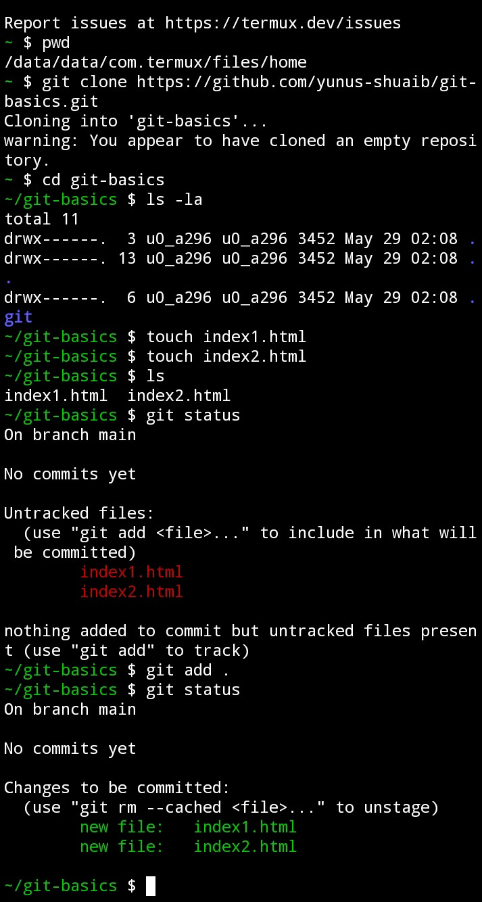

#### git commit and git branch commands
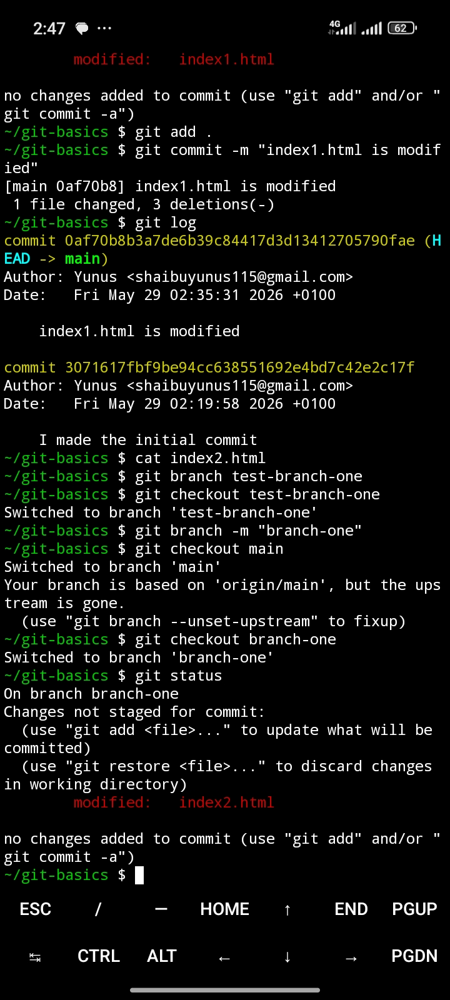

### git logs command
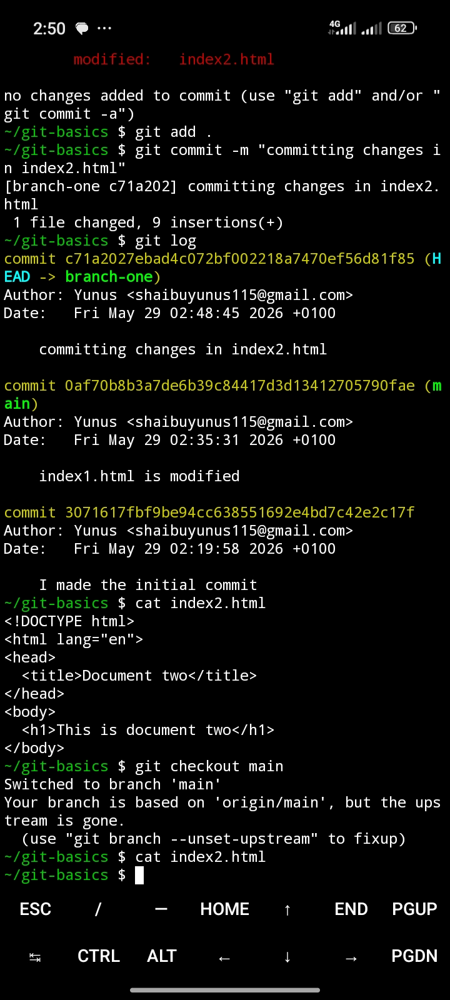

#### git reset command
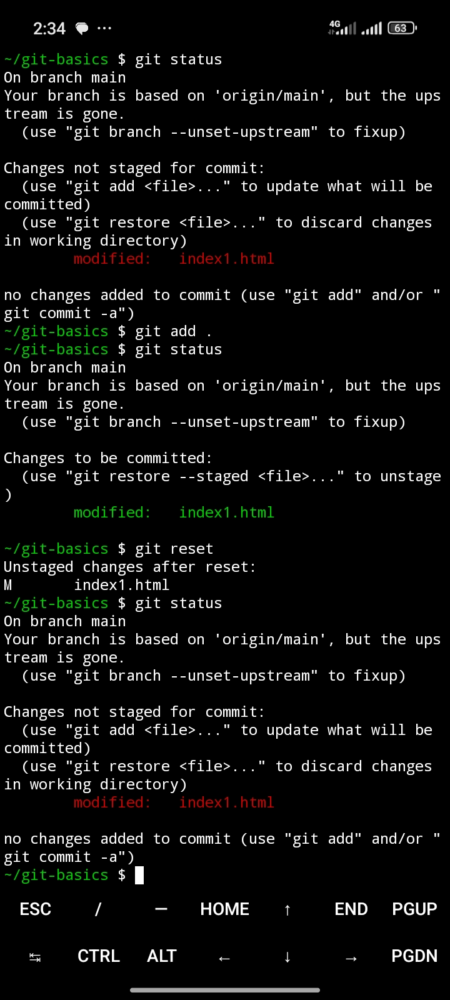

### git merge command
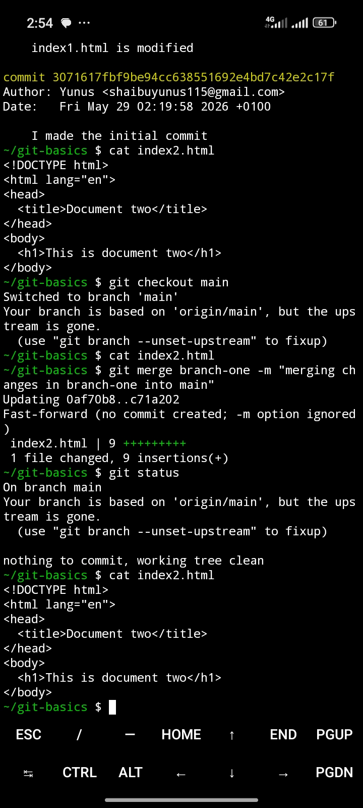

### merge conflict and resolving
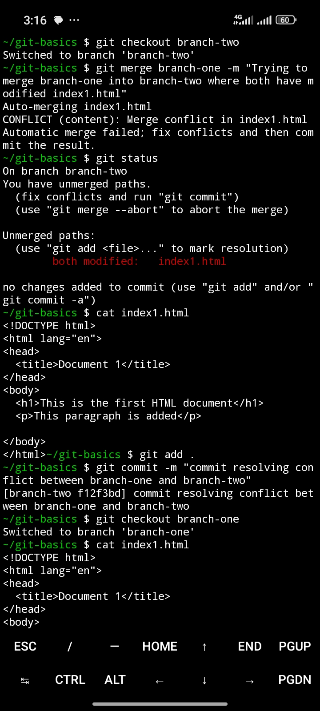

#### git handling of conflicts
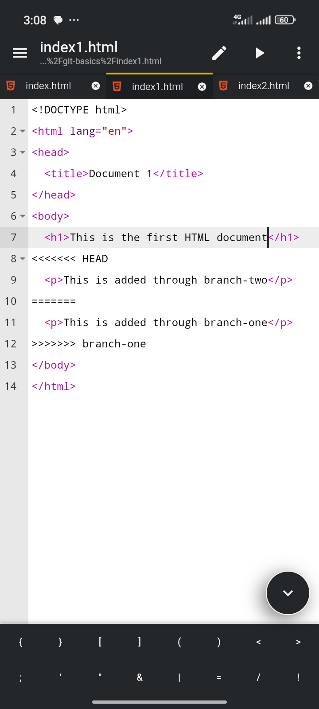

#### git push command
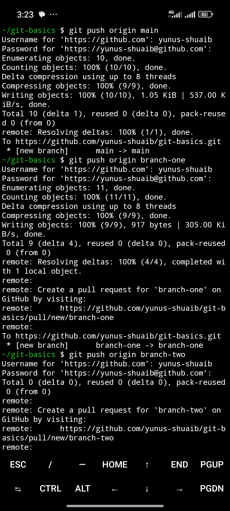
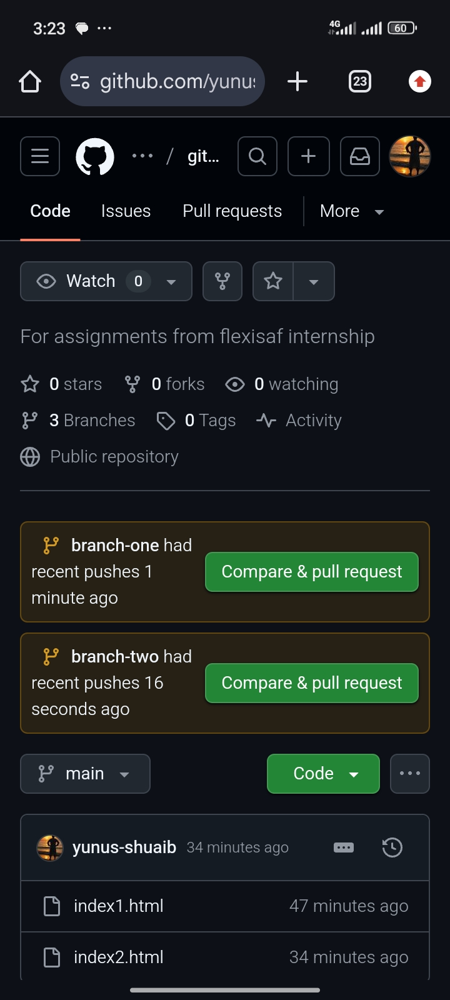

#### git fetch command
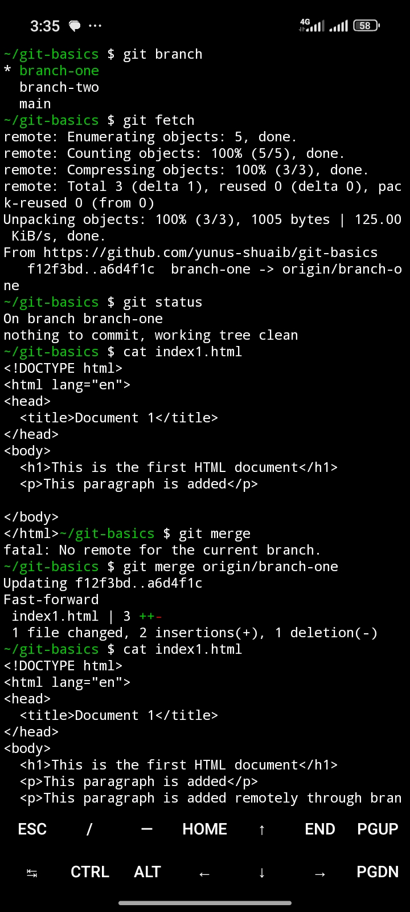

#### git pull command
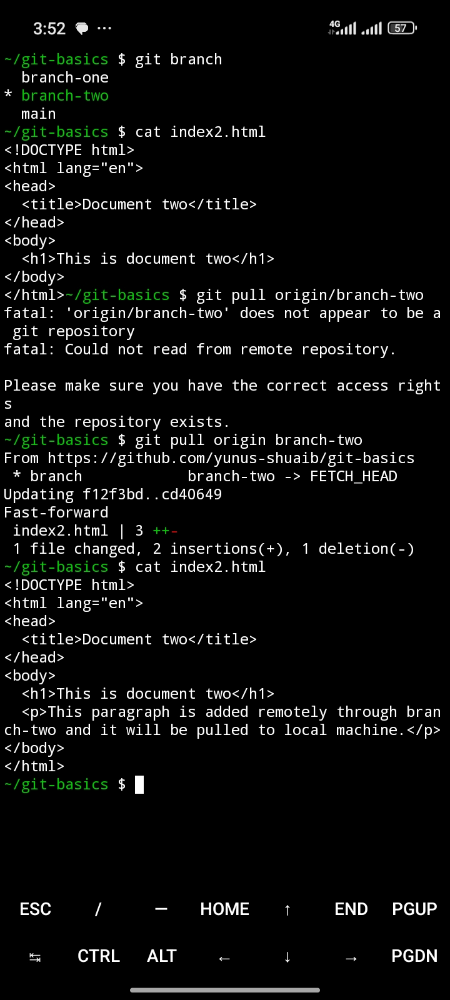

#### git stash command
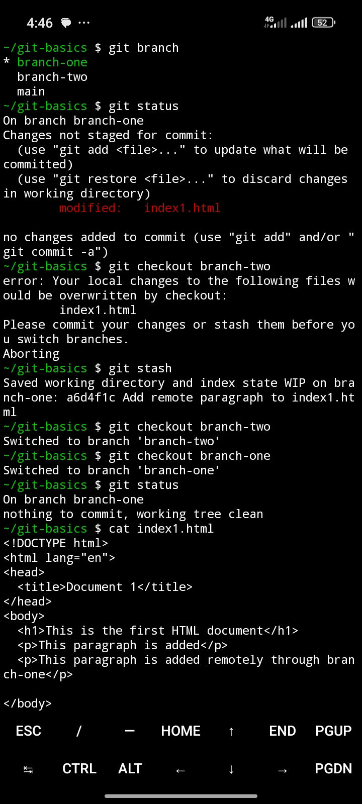
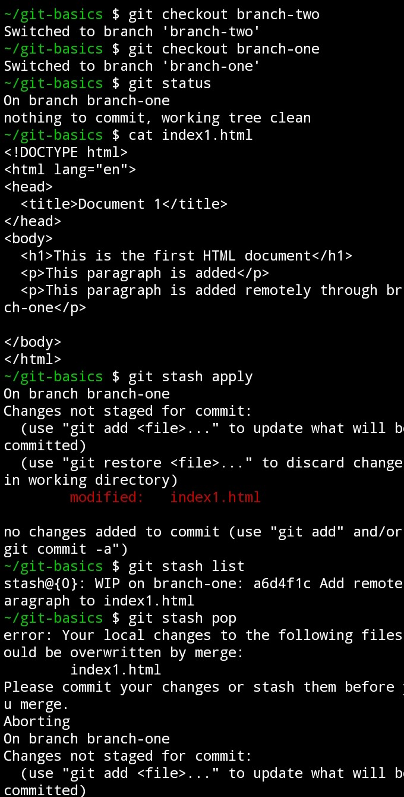

#### git revert command
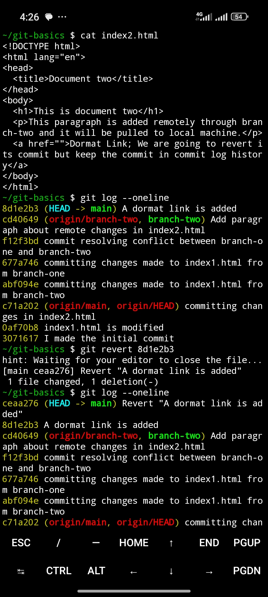
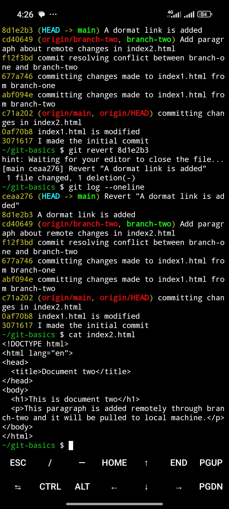

#### git rebase command
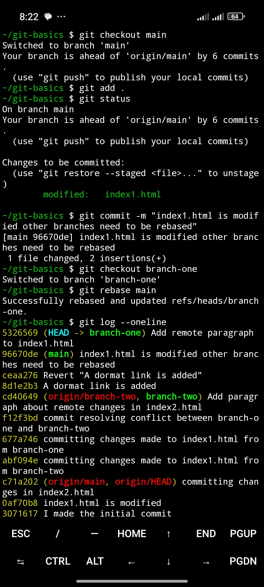
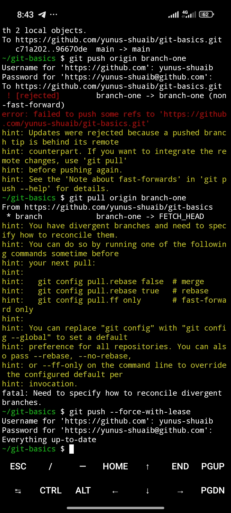

#### pull request was implemented

